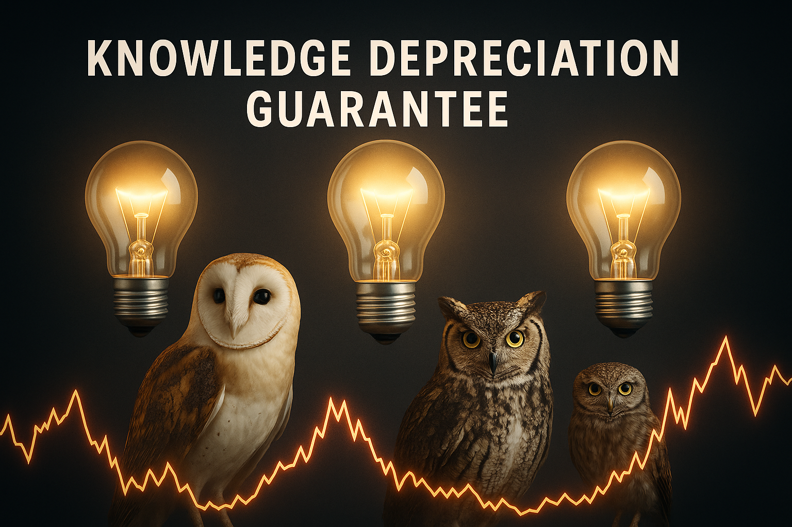

# Actuarial Blog Series

This repo includes the supporting notebooks for my series of blog posts exploring various actuarial topics through the lens of a novel insurance product, Knowledge Depreciation Guarantee (KDG), which covers sudden drops in value (measured by $\text{utility} \times \text{truthfulness}$) of knowledge assets, such as academic research papers.

---

**1. Survival Model.ipynb**
   - This supports [**When Truth Decays: Actuarial Adventures in Parametric Insurance Design**](https://medium.com/@alexfiliakov/when-truth-decays-actuarial-adventures-in-parametric-insurance-design-0e30f1d7a9d1)
     - What would the actuarial pricing of truth look like? Imagine if “knowledge” had a measurable risk of decay or distortion…

**2. Map of Knowledge.ipynb**
   - This supports [**When Truth Decays Part 2: Turning Knowledge into Liabilities**](https://medium.com/@alexfiliakov/when-truth-decays-part-2-turning-knowledge-into-liabilities-041e5e509e93)
     - We’ll explore the basics of actuarial reserving, using our hypothetical Knowledge Depreciation Guarantee as the illustrative example.

**3. Reinsurance Basics.ipynb**
   - This supports [**When Truth Decays Part 3: Reinsuring Epistemic Upheavals**](https://medium.com/@alexfiliakov/when-truth-decays-part-3-reinsuring-epistemic-upheavals-467243e8246c)
     - Exploring risk transfer strategies for our hypothetical insurer of knowledge assets.

**4. Quantum Cat Model.ipynb**
   - This supports the upcoming post: **When Truth Decays Part 4: Ontological Schrödinger's Cats**
     - Utilizing quantum algorithms to model, price, and reinsure the rare tremors that shake the very foundations of what we believe to be true.
